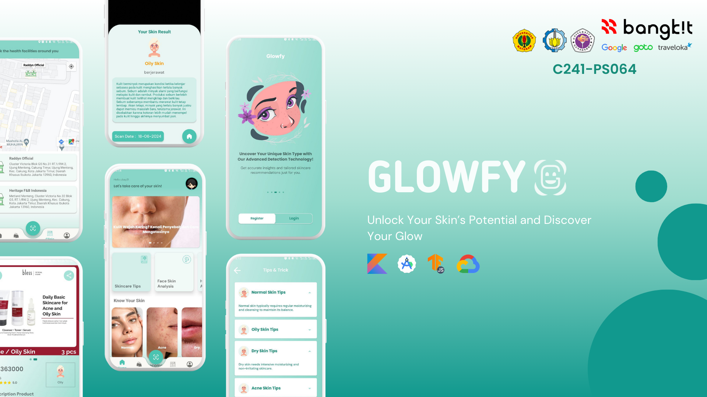

# Glowfy - Unlock Your Skin’s Potential and Discover Your Glow

(C241-PS064)

## Contributors

1. (MD) A009D4KY4471 - Muhammad Farhan Fathurrohman
2. (MD) A253D4KY4134 - Lalu Zhafran Farras Rahman
3. (CC) C009D4KY0268 - Muhammad Abdullaah Izzuddiin
4. (CC) C253D4KY0918 - Hilman Zulqarami
5. (ML) M004D4KX1512 - Anisa Ghina Salsabila
6. (ML) M253D4KX1925 - Nurul Anzila Wahyana
7. (ML) M004D4KX3373 - Dyas Amorita Radhwa Nashirah

## Other Repositories

#### ML - [Machine Learning Github Repository](https://github.com/dMorran/ML_Capstone/tree/main)

#### MD - [Mobile Development Github Repository](https://github.com/farhanfath/Glowfy)

## Our LinkedIn
| Nama       | LinkedIn     |
|---------------|-------------|
| Muhammad Farhan Fathurrohman| [](https://www.linkedin.com/in/farhan-fathur/)|
| Lalu Zhafran Farras Rahman|[](https://www.linkedin.com/in/laluzhafran/)|
| Muhammad Abdullaah Izzuddiin|[](https://www.linkedin.com/in/muhammad-abdullaah-izzuddiin/)|
| Hilman Zulqarami|[](https://www.linkedin.com/in/hilman-zulqarami/)|
| Anisa Ghina Salsabila|[](https://www.linkedin.com/in/anisa-ghina-salsabila-652723220/)|
| Nurul Anzila Wahyana|[](https://www.linkedin.com/in/nurul-anzila-wahyana/)|
| Dyas Amorita Radhwa Nashirah|[](https://www.linkedin.com/in/dyas-amorita-radhwa-nashirah-1044a2222/)|

# **Glowfy Backend API**

Glowfy Backend API provides a set of features for user registration, authentication, and data retrieval for skins, articles, and products. This API is designed to support mobile applications by offering secure and efficient data handling.


## **Features**

1. **User Registration**

2. **User Login**

3. **List Skins**

4. **List Articles**

5. **List Products**

6. **List Products by Category**
   
7. **Face Scan**
   
## **Installation**

Follow these steps to set up and run the project locally:

1. **Clone the Repository**
   - Open your terminal or command prompt.
   - Run the following command to clone the repository:
     ```bash
     git clone https://github.com/your-username/Glowfy.git
     ```
   - Navigate into the project directory:
     ```bash
     cd Glowfy
     ```

2. **Install Dependencies**
   - Run the following command to install all required dependencies:
     ```bash
     npm install
     ```

3. **Start the Server**
   - Start the server with the following command:
     ```bash
     npm start
     ```
   - The server should now be running on the specified port (default is usually `http://localhost:3000`).

## **Testing with Postman**

You can test the API endpoints using Postman:

1. **Postman Documentation**
   - Access the detailed Postman documentation for the API endpoints [here](https://documenter.getpostman.com/view/27540716/2sA3XV8zMK).

2. **Setup Authentication**
   - For endpoints that require authentication, add a header `Authorization: Bearer {token}` with your token value.

3. **Example Requests**
   - Follow the examples provided in the Postman documentation for constructing your requests.

## **Additional Notes**

- **Authentication Token**: Ensure that you replace the token with your own login token for authenticated requests.

- **API Documentation**: You can find more details about each endpoint and the expected request/response formats in the Postman documentation linked above.
